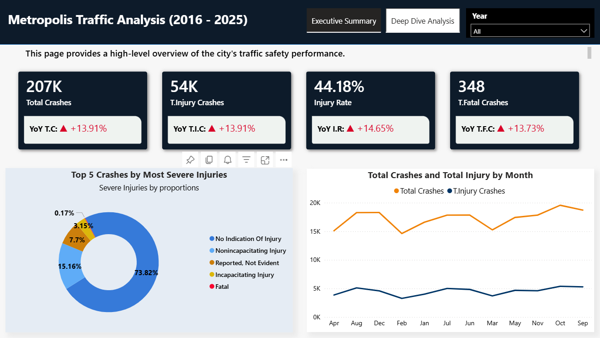
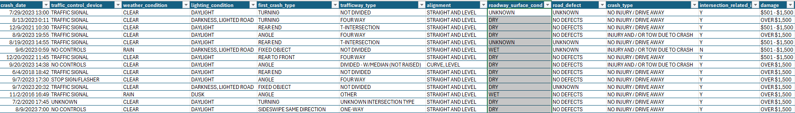
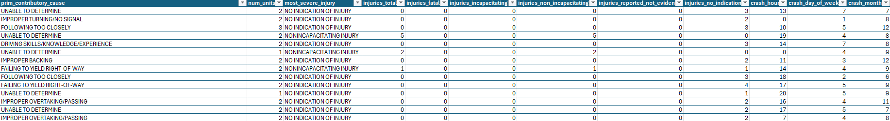

# Metropolis Traffic Safety Analysis Report (2016–2025)
Analyzing 10 years of traffic crash data to identify high-risk patterns, reduce injury rates, and support data-driven public safety planning using Power BI.

## Data Preview

 ## Executive Summary
- The Metropolis City Planning Department lacked a centralized, data-driven view of traffic crash patterns over the past decade, making it difficult to prioritize safety initiatives and allocate resources effectively.
- An interactive Power BI dashboard was developed to consolidate traffic crash data from 2016 to 2025, enabling stakeholders to monitor key safety KPIs, analyze crash severity, and identify high-risk time periods and road types.
- The analysis revealed 207K total crashes, 54K injury crashes, an injury rate of 44.18%, and 348 fatal crashes. Crash and injury trends increased steadily from 2016 to 2024, with peak incidents occurring between 3 PM and 5 PM. Four-way roadways were identified as the highest-risk trafficway type, while most crashes occurred during clear weather conditions, indicating behavioral and traffic-volume factors rather than environmental causes.

## The Business Problem
The Mayor of Metropolis required a data-driven assessment of traffic safety performance from January 2016 to December 2025 to justify budget allocations and prioritize interventions.

The objective was to transition from static crash reports to an interactive analytical solution capable of identifying trends, high-risk conditions, and actionable safety opportunities.

## Key Questions Addressed:
- How have traffic crash KPIs changed over time?
- What are the peak hours for crash occurrences?
- Which roadway types present the highest safety risk?
- What are the primary causes of severe crashes?
- How do environmental conditions affect crash frequency?

## The Process (Methodology)
### Tools Used:
Power BI, Power Query, DAX

### Data Sourcing & Overview
The dataset used for this analysis contains 207,356 rows and 29 columns, representing traffic crash records in Metropolis from January 2016 to December 2025.

### Data Cleaning & Transformation (ETL)
Using Power Query, the dataset was prepared for analysis:
- Removed duplicate entries from the dataset.
- Converted crash_date to Date format
- Created a Date Dimension Table and established relationships in the data model
- Inserted Year Column
- Filtered out Years from 2013 to 2015 that are less than 2016 

## Analysis & Insights
This section translates the dashboard visuals into actionable findings.
### KPI Trends & Crash Severity
- A total of 207,356 crashes were recorded between 2016 and 2025, averaging approximately 20,736 crashes per year, indicating a consistently high traffic incident volume across the decade.
- Total injury crashes reached 54K, representing an injury rate of 44.18%, meaning nearly 1 in every 2 crashes resulted in an injury. Fatal crashes totaled 348, highlighting that while fatalities are relatively low compared to total crashes, they remain a critical public safety concern.
- Year-over-Year analysis shows an overall increase in crash and injury metrics from 2016 to 2024, suggesting worsening safety conditions during this period. The sharp decline observed in 2025 is attributed to partial-year data and does not indicate a sustained improvement in traffic safety performance.

### Peak Crash Periods (Crash Hour Analysis)
- Crash frequency peaks between 3 PM and 5 PM, aligning with evening congestion and commuter traffic.

### High-Risk Roadway Types
 The Four-Way intersection records the highest number of crashes, making it the most high-risk trafficway. This is followed by Not Divided roads, Divided roads with non-raised medians, T-intersections, and One-way roads.

### Crash Severity Distribution
Most crashes resulted in no indication of injury, but a significant proportion led to non-incapacitating and incapacitating injuries, contributing to the 44.18% injury rate.
Fatal crashes are relatively low in number but remain critical for policy focus.

### Primary Contributory Causes of Severe Crashes
The leading category was “Unable to Determine”, highlighting a major data quality gap in crash investigations.

### Weather Impact on Crashes
The majority of crashes occurred during clear weather conditions, indicating that driver behavior and traffic volume are stronger risk factors than environmental conditions.

## Recommendations
Based on the analysis, the following actions are recommended for Metropolis:
- Deploy traffic officers between 3 PM and 5 PM and Increase monitoring at four-way intersections
- Redesign high-risk four-way roadways and Improve lane markings and signage on non-divided roads
- Standardize crash reporting procedures and also Reduce the “Unable to Determine” category through better investigation training
- Focus on peak-hour driving risks and Promote safe driving behavior even in clear weather

## Links
[Interactive powerbi Dashboard](https://app.powerbi.com/view?r=eyJrIjoiYjFmNzA1NGYtYjIzZS00ZmYxLTlmZTctNzgyMGU2MTlhZmQ1IiwidCI6IjM0NmYzNTNlLThhZjUtNGY5OS1hNDU2LTY0MDQ4ZDg2MDE0OSJ9)
